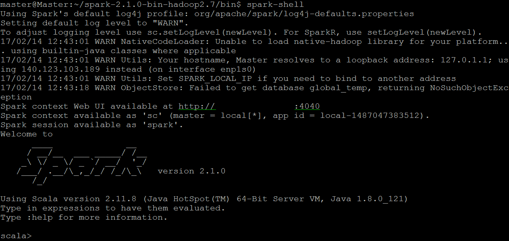

# Spark環境安裝
先介紹一下我佈署的環境：
- Ubuntu 16.04 LTS
- Java 8
- Scala 2.12.1
- Spark 2.1.0
- Hadoop 2.7

佈建Spark環境之前，需要先裝Java、Scala
下面會一步一步教如何安裝
教學最後我也寫了一個Script來幫助自動安裝
## Java環境安裝
```
$ add-apt-repository ppa:webupd8team/java
$ apt-get update
$ apt-get install -y oracle-java8-installer
$ apt-get install -y oracle-java8-set-default
```
## Scala環境安裝
因為我想裝在HOME目錄，所以cd到HOME目錄，這邊可以依照自行決定下載路徑
```
$ cd ~
$ wget http://downloads.lightbend.com/scala/2.12.1/scala-2.12.1.tgz
$ tar -xzvf scala-2.12.1.tgz
```
## Spark + Hadoop環境安裝
基本上可以到官方網站http://spark.apache.org/downloads.html
選擇你要的版本，這邊我是選spark-2.1.0-bin-hadoop2.7來做下載
我還是將它放到HOME目錄底下
```
$ cd ~
$ wget http://d3kbcqa49mib13.cloudfront.net/spark-2.1.0-bin-hadoop2.7.tgz
$ tar -xzvf spark-2.1.0-bin-hadoop2.7.tgz
```
## 環境變數
到這裡該下載的都完成了，再來就是設定環境變數
主要是編輯~/.bashrc這個檔案，在裡面新增下列指令
這邊要注意的一點是，SPARK_HOME與SCALA_HOME這邊是我剛剛下載的路徑，所以請按照自己環境設定
而JAVA_HOME一般來講是不用動的
```
export SPARK_HOME=~/spark-2.1.0-bin-hadoop2.7
export SCALA_HOME=~/scala-2.12.1
export JAVA_HOME=/usr/lib/jvm/java-8-oracle
export PATH=$SCALA_HOME/bin:$SPARK_HOME/bin:$JAVA_HOME/bin:$PATH
```
完成上列4條指令的新增，可執行下面指令來生效
```
$ source ~/.bashrc
```
## 執行Spark
最後一步就是執行Spark看看是否成功
到Spark目錄下的/bin/執行下面指令
```
$ spark-shell
```
看到下面結果就表示成功囉

## 自動安裝
在新的環境直接跑下面指令
```
$ wget https://raw.githubusercontent.com/aswergbh888/Spark/master/Install/SparkInstaller.sh -O - | sh
```
Spark會安裝在HOME目錄，所以要執行spark-shell就輸入下面指令
```
$ ~/spark-2.1.0-bin-hadoop2.7/bin/spark-shell
```
