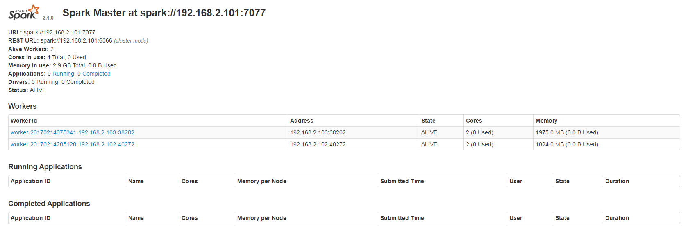

#Standalone Mode的佈建
## Cluster群集介紹


Spark可以建立群集來跨資源分配，基本上有三種模式可以選擇：
- **Standalone**
- Apache Mesos
- Hadoop YARN

這邊以Standalone來介紹如何建立環境。
## 環境介紹
我有三台電腦分別為：
- Master (IP：192.168.2.101)
- Slave1 (IP：192.168.2.102)
- Slave2 (IP：192.168.2.103)

這三台都按照之前的[教學](install.md)進行Spark的安裝，
並把Slave1與Slave2當作Worker Node。

## 環境設定
#### Master設定
到Spark目錄下的/sbin/執行下面指令
```
$ ./start-master.sh --host [Master_IP]
```
以我的例子，Master_IP就是192.168.2.101
執行完後，Master的位置會在192.168.2.101:7077(預設port)
在瀏覽器輸入Master_IP:8080，就會看到下面畫面

#### Slave設定
分別在每個Slave上建立起Worker Node，
所以到各個Slave輸入下列指令
```
$ ./start-slave.sh spark://[Master_IP]:7077
```
將Slave1、Slave2都加進來後會看到下面畫面

## 執行Application
#### Spark-Shell
一樣到Spark目錄下的/bin/執行之前所使用的Spark-Shell
但比較不一樣的，這次要指定Master
```
$ spark-shell --master spark://[Master_IP]:7077
```


#### PI迭代計算
這邊我們實際玩個例子
可以來跑一下官方自帶的Example Code，
以python所寫的迭代計算PI
到Spark目錄下的/examples/src/main/python/
執行下面指令，來迭代10次算出PI
```
$ spark-submit --master spark://[Master_IP]:7077 pi.py 10
```


## 參考
http://spark.apache.org/docs/latest/spark-standalone.html


