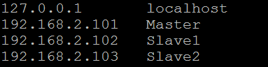
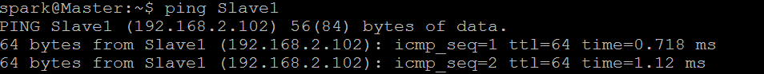
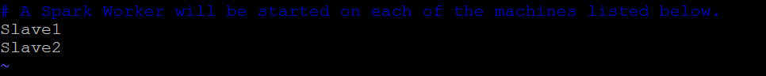
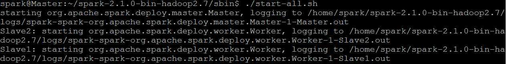

# Standalone Mode的佈建(二)
上一篇會發現我需要一一到Master與各個Slave中進行開啟的動作

今天電腦數量少還沒問題，但萬一數量多就不方便了

所以這篇要教的是如何只需啟動Master就能把Standalone的環境一次佈建好

其實概念很簡單，就是Master會自己透過SSH一一到各個Slave中進行啟動的動作
## 環境介紹
這邊一樣，有三台電腦分別為：

| Hostname | Username | IP            |
| :------: | :------: | :-----------: |
| Master   | spark    | 192.168.2.101 |
| Slave1   | spark    | 192.168.2.102 |
| Slave2   | spark    | 192.168.2.103 |

基本上Username都要取一樣以及Spark放的路徑也要一樣

目標一樣是在Slave1跟Slave2上建立起Worker Node
## 環境設定
#### Hostname設定
在Master與所有Slave的```/etc/hosts```加入各Hostname與IP對應，如下



要知道是否成功，可以在Master直接ping測試，如下
```
$ ping Slave1
```
> ping Slave1就等於ping 192.168.2.102



#### SSH免密碼登入設定
先安裝SSH
```
$ apt-get install openssh-server
```
> 一般要SSH連線都需要密碼，但其實可以透過建立起SSH public/private keys來進行免密碼登入
> 假設我想在A電腦免密碼登入B電腦，就先在A電腦產生public/private keys
> 並將A電腦的public key放到B電腦的~/.ssh/authorized_keys裡
> A電腦就能不需要密碼直接登入B電腦了

所以我們要做的是在Master產生SSH public/private keys

並透過ssh-copy-id指令將Master的public key複製到各個Slave的```~/.ssh/authorized_keys```檔案裡，做法如下
```
$ ssh-keygen -t rsa
$ ssh-copy-id -i ~/.ssh/id_rsa.pub spark@Slave1
$ ssh-copy-id -i ~/.ssh/id_rsa.pub spark@Slave2
```
> 在下ssh-keygen -t rsa指令時，它會要求一堆資訊直接按Enter到底就行了

在Master輸入完上面指令後，來測試一下是否免密碼登入
```
$ ssh spark@Slave1
```
#### 配置Worker Node
來到Master下，先到Spark目錄下的```/conf```

複製```slaves.template```一份為```slaves```
```
$ cp slaves.template slaves
```
修改slaves檔案，把要當作Worker Node的Hostname加進去，如下



把這份檔案複製給各個Slave的Spark目錄下```/conf```
```
$ scp -r slaves spark@Slave1:~/spark-2.1.0-bin-hadoop2.7/conf
$ scp -r slaves spark@Slave2:~/spark-2.1.0-bin-hadoop2.7/conf
```
## 執行Standalone
最後，直接在Master的Spark目錄```/sbin```下
```
$ ./start-all.sh
```
如果要結束就輸入下面指令
```
$ ./stop-all.sh
```



一樣到瀏覽器Master_IP:8080就會看到Slave1與Slave2已經當作Worker Node加進來了


