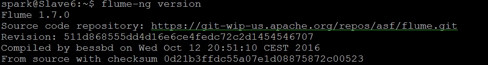
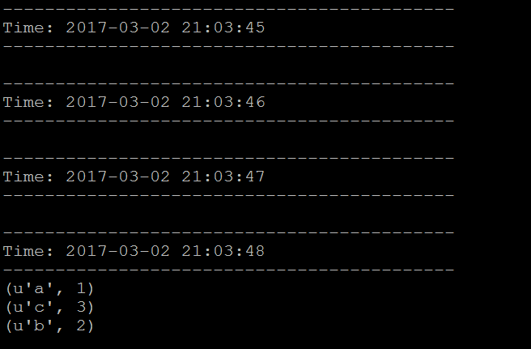

# Spark與Flume之環境建置
這篇教學會說明如何透過Flume來蒐集某一檔案的變化

將檔案變動的部分傳給Spark進行即時性的WordCount運算

## 什麼是Flume？
Flume是一個從可以收集例如日誌，事件等數據資源，並將這些數量龐大的數據從各項數據資源中集中起來存儲的工具與服務，或者數集中機制。

## 環境布建
Spark環境可參考之前[教學](../Install/README.md)來安裝
#### Flume安裝
下載可以到 http://flume.apache.org/download.html

這邊我使用```apache-flume-1.7.0```來進行安裝

一樣安裝到```HOME```目錄下
```
$ cd ~
$ wget http://apache.stu.edu.tw/flume/1.7.0/apache-flume-1.7.0-bin.tar.gz
$ tar zxvf apache-flume-1.7.0-bin.tar.gz
```
環境變數的部分使用```vim ~/.bashrc```來加入Flume的環境變數
```
export FLUME_HOME=~/apache-flume-1.7.0-bin
export PATH=$PATH:$FLUME_HOME/bin
```
使用下面指令來生效
```
$ source ~/.bashrc
```
輸入下面指令看看是否成功
```
$ flume-ng version
```


#### Flume Assembly
要藉由Flume把檔案變動的資料傳給Spark需要```Spark Project External Flume Assembly```的jar

所以可以到 http://mvnrepository.com/artifact/org.apache.spark/spark-streaming-flume-assembly_2.10

這邊我選擇```2.1.0```並且下載到Spark目錄裡的```/jars```裡
```
$ cd ~/spark-2.1.0-bin-hadoop2.7/jars
$ wget http://central.maven.org/maven2/org/apache/spark/spark-streaming-flume-assembly_2.10/2.1.0/spark-streaming-flume-assembly_2.10-2.1.0.jar
```
> ~/spark-2.1.0-bin-hadoop2.7/jars這是我的目錄，請依自己的目錄為準

#### Flume Configure
這邊主要是Flume要偵測哪一檔案的變化、及與Spark溝通port的相關設定

到剛剛下載並解壓縮完的Flume目錄下的```/conf```

使用```vim wordcount.conf```新增一個檔案並加入下面設定
```
a1.channels = c1
a1.sinks = k1
a1.sources = r1

a1.sinks.k1.type = avro
a1.sinks.k1.channel = c1
a1.sinks.k1.hostname = localhost
a1.sinks.k1.port = 29999

a1.sources.r1.type = exec
a1.sources.r1.command = tail -F /home/spark/test.txt
a1.sources.r1.channels = c1

a1.channels.c1.type = memory
a1.channels.c1.capacity = 1000
a1.channels.c1.transactionCapacity = 100
```
> /home/spark/test.txt 這是我要偵測的檔案，請依照自己的檔案為準

> a1.sinks.k1.port = 29999 則是等等要與Spark建立起溝通用的port

## 執行
#### Spark
這邊使用Spakr本身就用python寫好的WordCount程式

到Spark目錄下使用下面指令來執行

```
$ bin/spark-submit --jars jars/spark-streaming-flume-assembly_2.10-2.1.0.jar examples/src/main/python/streaming/flume_wordcount.py localhost 29999
```
#### Flume
到Flume目錄下使用下面指令來執行
```
$ bin/flume-ng agent --conf conf --conf-file ~/apache-flume-1.7.0-bin/conf/wordcount.conf --name a1 -Dflume.root.logger=INFO,console
```
#### 更改檔案
Spark與Flume都執行起來後，就會看到Spark每1秒接收一次資料

我們對要偵測的檔案寫入一些字進去，看看Spark是否有接收到並執行WordCount
```
$ echo 'a b b c c c' >> /home/spark/test.txt
```
> /home/spark/test.txt 這是我要偵測的檔案，請依照自己的檔案為準



> 這邊要注意的一點是需先執行Spark，接著再執行Flume

## 參考
https://kknews.cc/zh-tw/tech/nxn2ng.html


